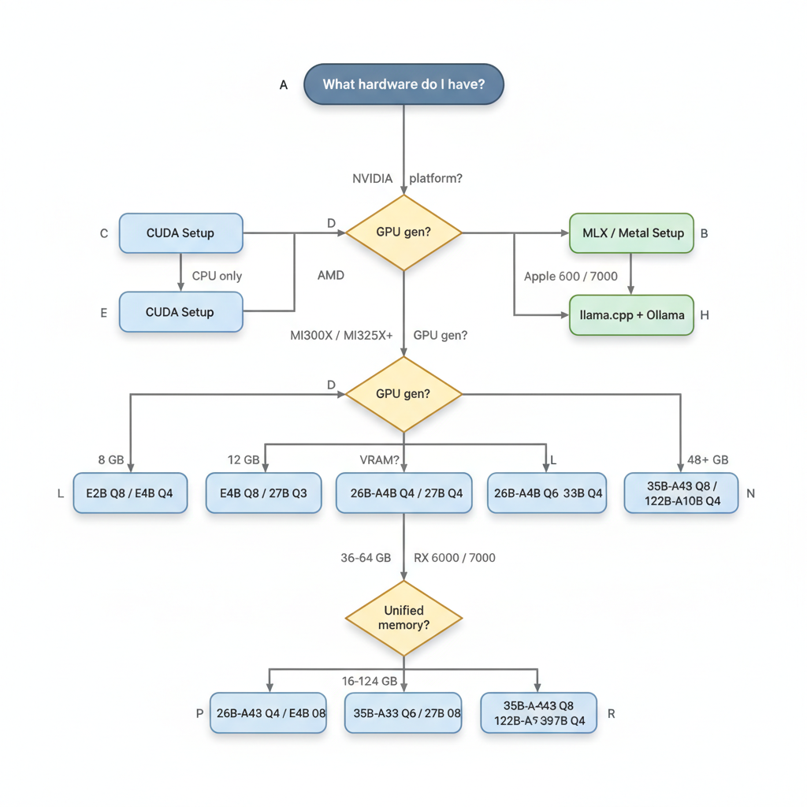

# Local LLM Guides

Team reference for running **Qwen3.5**, **Qwen3.6**, and **Gemma 4** models locally across NVIDIA (CUDA), AMD (ROCm), and Apple Silicon (MLX) hardware using llama.cpp, Ollama, vLLM, and LM Studio.

---

## Quick Decision Tree

**Backend — what do I want to do?**

*[view / edit source](https://mermaid.live/edit#pako:TZJRT8IwFIX/ypW50TB0qC/0QQMbkCWdYBDUjD3UtUhDt86uVZPBf3dzmaxNmpxz7v3a3LREiWIcYbST6jvZU23g2d9mUK3xRfSypwaYggAyztlDfAmDwT1Myvk6AM0/rdCVe2rKJ3V2fOPFEUi4ikgIK2OZUHE3flRH8MrQSiMGtuAariHXitnECJW1JO9M8svHTeAHY1AawuDWdV/7bZV/rtqQ6IuQMO4G9U3Ei6SkKb1K8jzusutwWj5ZkRyg4MbmDhhOUxgvgxY/PeMXJFr8ceJuVDNm5cxKCfPlGvrgVWeiMqOVbCGzzky8rlU3L8g2a7xqXhjjd/XTyA3pKuJ11eI/a3QiaVH4fAeVBzshJe4N6ZDecKeoHnLguHdHRy4bOYmSSuMed+u9zZCDUq5TKhjCJTJ7ntafgFF9QCcH2ZxRw31BPzRNETba8tMv)*

**Hardware — what do I have?**

*[view / edit source](https://mermaid.live/edit#pako:bZNfb5swFMW/yhV52ZSw8SclgYdVELKMLTRtunSRKA8emAbVYOSQdhXku8+YJAVt8ICv/TvnnmuJSopojCVLSgh9jXaIlfDTfcyBP/aH4NcOlcA341fEMMQUPF694OvwI8jyF3Cqxe0GPkNBUJlQll0fW6XTnNY3D57r2TXMgtnGteEel4ci7AK279bgCo8nnPfFdlEQDPcpSSOa1zAP/OWWd/Jxich/rGbcg+bkrYavASEoQ5+iogC+y6mWcwXne7qiCCNP1662wxoWwcty6cMQLrKwK1hvwVAUhSsm/FPDt479EFaiuPSYiVvxqoe17Z/H8YTNFBZODd+DuebA3ZS7zcd8MQ67jKoJ6EcgzhpIm/CF3ocMAS0DzXBkW5icwb6bNhag/w4aHNSveKH/A4+nQ0HfBBeg6a9qGq9U5cS3irkYclVt8jRJcQwZzih7O4+7OqWUT/1v+0Hb0cIuqxuy0bJ3792N81B91jRk1WyvaR100jVhdXPSyxkRtN+7OIHf9A8kKSHWQEUq0vBoXzL6jK3BGJlKbI4iSiizBlhp3sdcGkkZZhlKY8mqpHKHs+b3iBF7lo4j6VDEqMRuip4YyiSrZAd8/As=)*

---

## Model Selection Matrix

### Gemma 4 (Apache 2.0, released Apr 2026)

| Variant | Arch | Total Params | Active Params | Context | Modalities | 4-bit RAM | Best For |
|---------|------|-------------|---------------|---------|-----------|-----------|----------|
| E2B | Dense+PLE | ~9.6 GB BF16 | all | 128K | Text, Image, Audio | ~3 GB | Phone / edge / Raspberry Pi |
| E4B | Dense+PLE | ~15 GB BF16 | all | 128K | Text, Image, Audio | ~5 GB | Laptops, 8 GB RAM machines |
| 26B-A4B | MoE | 26B | 4B active | 256K | Text, Image | ~16 GB | Best speed/quality balance |
| 31B | Dense | 31B | all | 256K | Text, Image | ~17 GB | Highest quality at 31B scale |

### Qwen3.5 (Apache 2.0, released Feb 2026)

| Variant | Arch | Total Params | Active Params | Context | 4-bit RAM | Best For |
|---------|------|-------------|---------------|---------|-----------|----------|
| 27B | Dense | 27B | all | 262K | ~14 GB | Strong dense, fits 16 GB VRAM |
| 35B-A3B | MoE | 35B | 3B active | 262K | ~18 GB | Fast MoE, coding + reasoning |
| 122B-A10B | MoE | 122B | 10B active | 262K | ~62 GB | Multi-GPU powerhouse |
| 397B-A17B | MoE | 397B | 17B active | 262K | ~200 GB | Data center / multi-node |

> All Qwen3.5 models have native vision support and hybrid thinking.

### Qwen3.6 (Apache 2.0, released Apr 2026)

| Variant | Arch | Total Params | Active Params | Context | 4-bit RAM | Best For |
|---------|------|-------------|---------------|---------|-----------|----------|
| 35B-A3B | MoE | 35B | 3B active | 256K (1M YaRN) | ~23 GB | Agentic coding, best single-GPU MoE |

> Qwen3.6 supports 201 languages, multimodal vision, and hybrid thinking (thinking/non-thinking mode toggle).

---

## Backend Comparison

| Backend | Best Use Case | GPU Support | Format | API | Difficulty |
|---------|--------------|-------------|--------|-----|------------|
| **LM Studio** | Local exploration, GUI | CUDA, ROCm, Metal | GGUF | OpenAI-compat | Beginner |
| **Ollama** | Fast local API, teams | CUDA, ROCm, Metal | GGUF | OpenAI-compat | Beginner |
| **llama.cpp** | Full control, CPU+GPU, servers | CUDA, ROCm, Metal, CPU | GGUF | OpenAI-compat | Intermediate |
| **vLLM** | Production serving, multi-GPU | CUDA, ROCm (MI300+) | BF16/FP8/AWQ | OpenAI-compat | Advanced |

---

## Hardware Compatibility Matrix

| Model | 8 GB VRAM | 12 GB VRAM | 16 GB VRAM | 24 GB VRAM | 48 GB VRAM | 80 GB VRAM |
|-------|-----------|-----------|-----------|-----------|-----------|-----------|
| Gemma 4 E2B | Q8 | BF16 | BF16 | BF16 | BF16 | BF16 |
| Gemma 4 E4B | Q4 | Q8 | BF16 | BF16 | BF16 | BF16 |
| Gemma 4 26B-A4B | — | — | Q4 | Q6 | BF16 | BF16 |
| Gemma 4 31B | — | — | Q4 | Q6 | BF16 | BF16 |
| Qwen3.5 27B | — | — | Q4 | Q6 | BF16 | BF16 |
| Qwen3.5/3.6 35B-A3B | — | — | — | Q4 | Q6-Q8 | BF16 |
| Qwen3.5 122B-A10B | — | — | — | — | — | Q4 (2×80) |

> For CPU-only or partial GPU offload, llama.cpp can layer-split across VRAM + system RAM. Expect slower generation.

---

## Recommended Quantizations (GGUF)

| Use Case | Quantization | Notes |
|----------|-------------|-------|
| Maximum quality | Q8_0 | Near-lossless; largest file |
| Best quality/size balance | Q4_K_M or UD-Q4_K_XL | Unsloth Dynamic quants preferred |
| Memory constrained | Q3_K_M | Slight quality drop |
| Ultra-low RAM | Q2_K / UD-Q2_K_XL | Noticeable degradation |

**Unsloth Dynamic (UD) quants** are strongly preferred — they use higher precision for critical layers (embeddings, attention) while compressing others, achieving better quality at the same file size vs. standard GGUF quants.

---

## Cost Comparison

- [cost-comparison.md](cost-comparison.md) — Hardware costs, electricity, 3-year TCO, cloud API
  pricing (DeepSeek, Kimi, GLM, Mistral), benchmark comparison, and break-even analysis

## Model Guides

- [models/qwen3.5.md](models/qwen3.5.md) — Qwen3.5 family (27B, 35B-A3B, 122B-A10B, 397B-A17B)
- [models/qwen3.6.md](models/qwen3.6.md) — Qwen3.6-35B-A3B (latest, agentic coding)
- [models/gemma4.md](models/gemma4.md) — Gemma 4 (E2B, E4B, 26B-A4B, 31B)

## Backend Guides

- [backends/llama-cpp.md](backends/llama-cpp.md) — Build, run, serve (all hardware)
- [backends/ollama.md](backends/ollama.md) — One-command setup
- [backends/vllm.md](backends/vllm.md) — Multi-GPU production serving
- [backends/lmstudio.md](backends/lmstudio.md) — GUI guide

## Hardware Guides

- [hardware/cuda.md](hardware/cuda.md) — NVIDIA CUDA setup
- [hardware/rocm.md](hardware/rocm.md) — AMD ROCm setup
- [hardware/mlx.md](hardware/mlx.md) — Apple Silicon MLX setup

## Agent Integration

- [agent-integration.md](agent-integration.md) — Connecting Amplifier agents to local LLMs

---

## Common Gotchas

- **CUDA 13.2 + GGUF**: Do not use the CUDA 13.2 runtime with any GGUF model — it produces garbage output. Use CUDA 12.x or 13.0. NVIDIA is tracking this.
- **Qwen3.x thinking mode**: Must be explicitly toggled per use case. Wrong mode = wrong sampling params = bad output. See model guides.
- **Gemma 4 EOS token**: The end-of-sentence token is `<turn|>`, not `</s>`. Some older inference wrappers may not stop correctly.
- **MoE VRAM**: All MoE model weights load into VRAM even though only a fraction is active per token. Plan for full model size in VRAM.
- **KV cache overhead**: Hardware tables show weight-only memory. Add 10–30% for KV cache at typical context lengths. Reduce `--ctx-size` if OOM.
- **ROCm consumer GPUs**: vLLM officially only supports MI300X+ for AMD. Use llama.cpp for RX 6000/7000 series.
