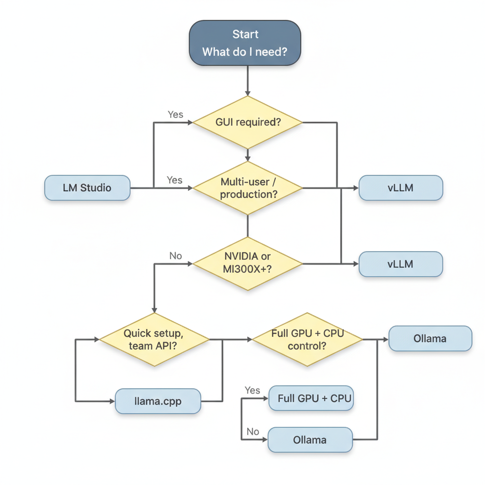

# LM Studio Guide

**LM Studio** is a desktop application for discovering, downloading, and running LLMs locally. No command line required. It provides a chat UI and a local OpenAI-compatible server — the best starting point for team members who are not comfortable with CLI tools.

- Site: https://lmstudio.ai
- Platforms: macOS, Windows, Linux
- Format: GGUF
- API: OpenAI-compatible at `http://localhost:1234`

---


*[view / edit source](https://mermaid.live/edit#pako:TZJRT8IwFIX/ypW50TB0qC/0QQMbkCWdYBDUjD3UtUhDt86uVZPBf3dzmaxNmpxz7v3a3LREiWIcYbST6jvZU23g2d9mUK3xRfSypwaYggAyztlDfAmDwT1Myvk6AM0/rdCVe2rKJ3V2fOPFEUi4ikgIK2OZUHE3flRH8MrQSiMGtuAariHXitnECJW1JO9M8svHTeAHY1AawuDWdV/7bZV/rtqQ6IuQMO4G9U3Ei6SkKb1K8jzusutwWj5ZkRyg4MbmDhhOUxgvgxY/PeMXJFr8ceJuVDNm5cxKCfPlGvrgVWeiMqOVbCGzzky8rlU3L8g2a7xqXhjjd/XTyA3pKuJ11eI/a3QiaVH4fAeVBzshJe4N6ZDecKeoHnLguHdHRy4bOYmSSuMed+u9zZCDUq5TKhjCJTJ7ntafgFF9QCcH2ZxRw31BPzRNETba8tMv)*

## Installation

1. Download the installer for your OS from [lmstudio.ai](https://lmstudio.ai)
2. Run the installer
3. On first launch, LM Studio detects your GPU automatically:
   - **NVIDIA**: uses CUDA acceleration
   - **AMD**: uses ROCm acceleration (Windows/Linux only)
   - **Apple Silicon**: uses Metal acceleration (best performance on macOS)
   - **CPU fallback**: used if no GPU detected

---

## Downloading Models

### Via the Model Browser (recommended)

1. Open LM Studio
2. Click **Discover** (binoculars icon) in the left sidebar
3. Search for the model name:
   - `gemma-4` → selects Gemma 4 variants
   - `qwen3.6` → Qwen3.6 variants
   - `qwen3.5` → Qwen3.5 variants
4. Select your hardware tier (quantization is suggested automatically based on your detected VRAM)
5. Click **Download**

### Recommended Picks

| Your VRAM / RAM | Gemma 4 | Qwen3.6 | Qwen3.5 |
|----------------|---------|---------|---------|
| 8 GB | E4B Q4 or Q8 | — | — |
| 16 GB | 26B-A4B Q4 or 31B Q4 | 35B-A3B Q3 | 27B Q4 |
| 24 GB | 26B-A4B Q6/Q8 or 31B Q6 | 35B-A3B Q4 | 27B Q6/Q8 |
| 32 GB (unified Mac) | 26B-A4B Q8 or 31B Q8 | 35B-A3B Q6 | 35B-A3B Q4 |
| 48 GB (unified Mac) | 31B BF16 or 26B-A4B BF16 | 35B-A3B Q8 | 35B-A3B Q6 |

> "Unified" memory on Apple Silicon counts as both RAM and VRAM.

### From Hugging Face Directly

If a model isn't in LM Studio's catalog:

1. Click **Discover** → switch to **Hugging Face** tab (or use the search field)
2. Paste the HuggingFace repo ID: `unsloth/gemma-4-26B-A4B-it-GGUF`
3. Select the quantization variant (look for `UD-Q4_K_XL` for best quality/size balance)
4. Click **Download**

---

## Running Models

### Chat Interface

1. Click **Chat** in the left sidebar
2. Click the model selector at the top
3. Pick a downloaded model
4. Wait for it to load (progress bar at top)
5. Start chatting

### Adjusting Parameters

In the chat view, open the **Model Parameters** panel (right sidebar):

| Parameter | Gemma 4 | Qwen3.5/3.6 (thinking) | Qwen3.5/3.6 (non-thinking) |
|-----------|---------|------------------------|---------------------------|
| Temperature | 1.0 | 0.6–1.0 | 0.7 |
| Top P | 0.95 | 0.95 | 0.8 |
| Top K | 64 | 20 | 20 |
| Max Tokens | 4096+ | 32768+ | 4096 |

### Enabling Thinking Mode

For Qwen3.x and Gemma 4 hybrid thinking models, set the system prompt:

**Qwen3.x thinking on**:
```
/think
```
(or include `<think>` at the start of your system prompt, depending on the template version)

**Gemma 4 thinking on**:
```
<|think|>
You are a careful reasoning assistant.
```

**Gemma 4 thinking off** — just use a normal system prompt without `<|think|>`.

---

## Local Server (OpenAI-compatible API)

LM Studio can run a local server for use by code, agents, and other tools.

### Starting the Server

1. Click **Developer** (code icon) in the left sidebar
2. Click **Start Server**
3. Server starts at `http://localhost:1234` by default

You can also load a specific model for the server:
- Select the model from the dropdown at the top of the Developer tab
- Adjust server parameters (port, context length, parallel requests)

### Python Usage

```python
from openai import OpenAI

client = OpenAI(
    base_url="http://localhost:1234/v1",
    api_key="lm-studio",  # required but not validated
)

response = client.chat.completions.create(
    model="gemma-4-26b-a4b-it",   # use the model's display name from LM Studio
    messages=[
        {"role": "system", "content": "You are a helpful assistant."},
        {"role": "user", "content": "What is the capital of France?"}
    ],
    max_tokens=512,
    temperature=1.0,
)
print(response.choices[0].message.content)
```

> **Tip**: The `model` parameter in API calls must match the loaded model's identifier shown in LM Studio's Developer tab.

### cURL

```bash
curl http://localhost:1234/v1/chat/completions \
  -H "Content-Type: application/json" \
  -d '{
    "model": "gemma-4-26b-a4b-it",
    "messages": [{"role": "user", "content": "Explain neural networks simply."}],
    "temperature": 1.0,
    "max_tokens": 1024
  }'
```

---

## Server Configuration

In the **Developer** tab:

| Setting | Recommendation |
|---------|---------------|
| Port | 1234 (default) or custom |
| Context Length | Start at 16384; increase if needed |
| Concurrent Requests | 1–4 (depends on VRAM) |
| Apply Prompt Formatting | On (ensures correct chat template) |

### Exposing to the Network

By default, LM Studio binds to `localhost` only. To allow other machines:

- In Developer settings → **Network**: change bind address to `0.0.0.0`
- Ensure your firewall allows the port
- Other machines can then access via `http://<your-ip>:1234`

---

## Hardware Configuration

### GPU Layers

In the **Model Parameters** panel:

- **GPU Offload**: set the number of layers to offload. `Max` offloads everything to GPU (fastest).
- If the model doesn't fit entirely in VRAM, reduce GPU layers — CPU handles the remainder (slower).

### Flash Attention

Enable in Model Parameters when available. Reduces VRAM usage at long context lengths.

---

## Tips for Apple Silicon (M1/M2/M3/M4)

- LM Studio uses Metal acceleration automatically
- Unified memory means RAM and VRAM are the same pool — a 32 GB M3 Pro can fully load a 26B Q4 model
- Use **MLX variants** for even better performance on Apple Silicon: look for models tagged `MLX` in the LM Studio catalog (these are `mlx_vlm` format internally)
- For maximum Apple Silicon performance with Qwen3.6 and Gemma 4, consider using the mlx_vlm CLI approach instead — see [hardware/mlx.md](../hardware/mlx.md)

---

## Common Workflows for Team Members

### "I want to test a model quickly"

1. Open LM Studio → Discover
2. Download Gemma 4 26B-A4B (UD-Q4_K_XL recommended)
3. Chat tab → load model → start chatting

### "I want to give the model to my code"

1. Download a model
2. Developer tab → Start Server
3. Use `http://localhost:1234/v1` as your base URL with the `openai` SDK

### "The model is slow"

- Check GPU offload: max out GPU layers
- Reduce context length
- Try a smaller quantization (Q4 instead of Q8)
- Close other GPU-heavy applications

### "The model runs out of memory"

- Reduce GPU layers (force some layers to CPU)
- Use a lower quantization (Q4_K_M instead of Q8)
- Pick a smaller model variant (E4B instead of 26B)

---

## Troubleshooting

| Symptom | Fix |
|---------|-----|
| Model won't load | Check available VRAM; try smaller quantization |
| Chat stops mid-response | Context length exceeded; reduce or increase context limit |
| Wrong output / no stop token | Update LM Studio to latest version (EOS token fixes) |
| Server not accessible from other machine | Bind to 0.0.0.0 in Developer settings |
| GPU not used | Update GPU drivers; reinstall LM Studio |
| Very slow first response | Normal — model is loading into memory |
| Thinking traces visible in output | Normal for Gemma 4/Qwen3.x in thinking mode |
