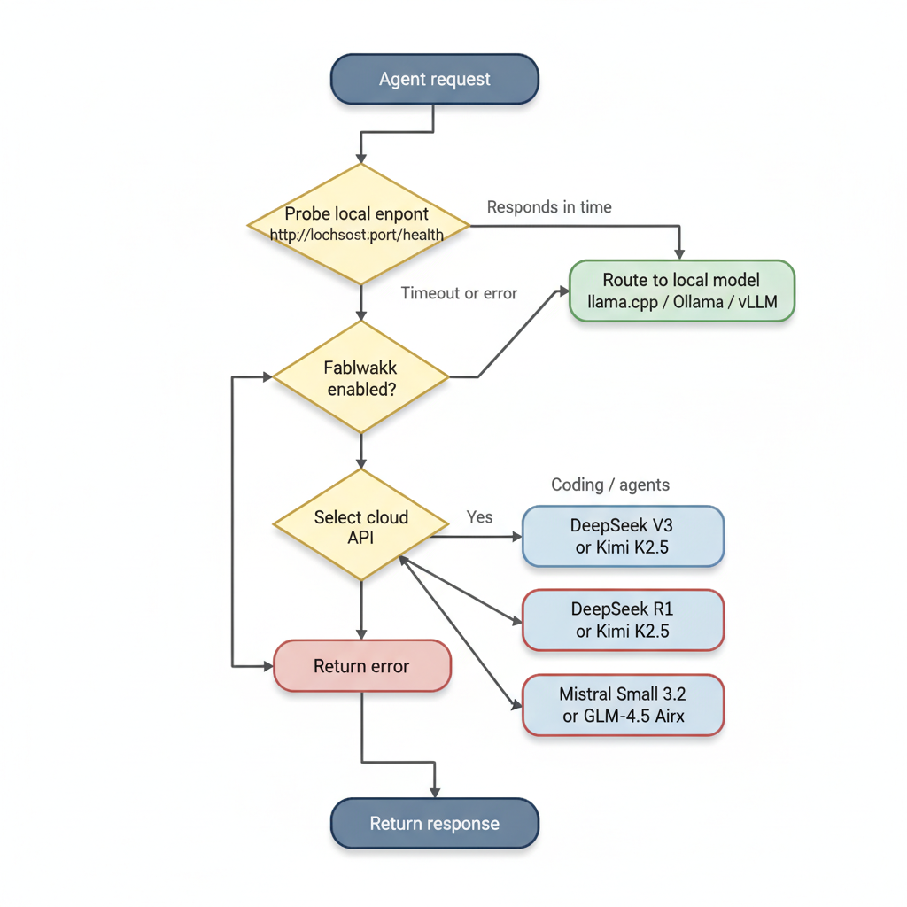

# Cost Comparison: Local Hardware vs. Cheap Cloud APIs

A practical cost and benchmark analysis for teams deciding between self-hosted local models
(Qwen3.5 / Qwen3.6 / Gemma 4) and low-cost API providers — DeepSeek, Kimi, GLM, and Mistral.

Prices and benchmarks current as of **April 2026**. All prices USD.

---

## TL;DR

| Scenario | Go Local | Go API |
|----------|----------|--------|
| Privacy / air-gap required | **Yes** | No |
| Volume > ~3M tokens/day | **Yes** | Rarely |
| Volume < 1M tokens/day | Unlikely | **Yes** |
| Single developer / team | Depends on hardware you own | **Probably** |
| Latency < 50 ms first token | **Yes** (LAN) | Rarely |
| No upfront capital | No | **Yes** |
| Best raw quality at any cost | No (for now) | **Maybe** |


*[view / edit source](https://mermaid.live/edit#pako:fZNfb9owFMW/ylX60kr8DXRV/bCJkgJTYatCNWkFHox9IRaOndlOO4nw3WeS0JU+NH7Jyc3v5Nx7lX3ANMeABBupX1lCjYOnaKnAX4PLxWCLyoHBPzlat7qCZvMr3O0fjV4jSM2oBFQ800K55VIlzmWk3S6fJ9o6kmnj2glS6ZJDZXl3dChitJlW3IJQ4ESKBQwXsc4dgtO1bepDSe8pJU1pi2UZtOFnKfzNy3Q6W703fPImngdtAI3RpoBoP6JSrinb+YR0LZF/qyNEJfEbbQH3+zlKZA6Y1DmHweP3s3d+6AKeFzG63KjKt/7ofVkeai7U1sehxyF5u9EiQszmiDv41fPZfZoHkQp4CFvXZ2SM1GpVwSl1SQHj/2jc/Qwd+rk2LSornHjxg5ssZsI64yc2T33D0GuFFT6ezpr91jUMhPlbOwzL9cWXp5ZMuQaLq6uqPqrqlRi/F5OTqI0IIeWaas7LcoI1eS4n5/LZSz/LkxWT1NoIN/XaN0JKctHhvV7Ybfi+9A7JRXhD8UunwbTUhlxg53g+0NUCK7pLuzTEN7pPbzv89lPa56nZkHf8eWPxps967CMbNIIUTUoFD8g+cAmmx/+HU7MLDo0gzzh1GAm6NTQNiDM5Hv4B)*

---

## 1. Local Hardware Costs

### 1.1 NVIDIA GPU Builds

GPU-only prices (you need a host system — assume $600–800 for a budget PC if starting from scratch).

| GPU | VRAM | Street Price (Apr 2026) | TDP | System Total Power | Full System Cost est. |
|-----|------|------------------------|-----|-------------------|----------------------|
| RTX 3090 (used) | 24 GB | ~$800 | 350 W | ~500 W | ~$1,400 (GPU + PC) |
| RTX 4090 (used) | 24 GB | ~$1,100 | 450 W | ~650 W | ~$1,800 (GPU + PC) |
| RTX 5090 | 32 GB | ~$2,000 | 575 W | ~800 W | ~$2,700 (GPU + PC) |
| 2× RTX 3090 (used) | 48 GB | ~$1,600 | 700 W | ~900 W | ~$2,400 (GPUs + PC) |
| RX 7900 XTX (ROCm) | 24 GB | ~$900 | 355 W | ~550 W | ~$1,500 (GPU + PC) |

> **RTX 3090 vs 4090**: The 4090 is ~30–40% faster on token generation for the same GGUF models.
> At 24 GB VRAM, both run identical model sizes. The 3090's lower cost makes it compelling for
> budget builds. The 5090 (32 GB) opens access to Q6 on 35B-A3B without CPU offload.

**What each GPU runs** (GGUF, full GPU offload):

| GPU / VRAM | Gemma 4 E4B Q8 | Gemma 4 26B-A4B Q4 | Qwen3.5 27B Q4 | Qwen3.6 35B-A3B Q4 |
|------------|---------------|---------------------|-----------------|---------------------|
| 24 GB (3090/4090) | Yes | Yes (~16 GB) | Yes (~14 GB) | Partial CPU offload (~23 GB) |
| 32 GB (5090) | Yes | Yes | Yes | Yes (Q4, full GPU) |
| 48 GB (2× 24 GB) | Yes | Yes | Yes | Yes (Q6, high quality) |

### 1.2 Apple Silicon (all-in-one, no extra system needed)

Unified memory = shared CPU/GPU pool. Inference is GPU-accelerated via Metal / MLX.

| Device | Unified Memory | Street Price | TDP (max load) | What it runs |
|--------|---------------|-------------|----------------|--------------|
| Mac Mini M4 (base) | 16 GB | ~$599 | ~20 W | Gemma 4 E4B Q8, Qwen3.5 27B Q3 |
| Mac Mini M4 Pro | 24 GB | ~$1,399 | ~28 W | Gemma 4 26B-A4B Q4, Qwen3.5 27B Q4 |
| Mac Mini M4 Pro | 48 GB | ~$1,799 | ~35 W | Qwen3.6 35B-A3B Q6, Qwen3.5 35B Q6 |
| Mac Studio M4 Max | 36 GB | ~$1,999 | ~100 W | Qwen3.6 35B-A3B Q4, Qwen3.5 27B Q8 |
| Mac Studio M4 Max | 64 GB | ~$2,799 | ~120 W | Qwen3.6 35B-A3B Q8, Qwen3.5 122B-A10B Q2 |
| Mac Studio M3 Ultra | 192 GB | ~$4,999 | ~200 W | Qwen3.5 122B-A10B Q8, 397B-A17B Q2 |

> **Token generation speed** at 4-bit on Gemma 4 26B-A4B (typical): M4 Max 36 GB ≈ 40–55 tok/s
> via MLX, M3 Max 48 GB ≈ 35–45 tok/s, RTX 4090 (CUDA) ≈ 55–75 tok/s. Apple Silicon is
> dramatically more efficient per watt; NVIDIA wins in raw throughput.

---

## 2. Electricity Costs

Based on US average **$0.14/kWh** (EIA 2025). Adjust for your region — EU is ~2×, parts of Asia ~0.5×.

### 2.1 Annual electricity at 8 hours/day active inference

| Hardware | Active Power | kWh/year (8 h/day) | Cost/year | Cost/month |
|----------|--------------|--------------------|-----------|-----------|
| RTX 3090 + system | ~500 W | 1,460 kWh | ~$204 | ~$17 |
| RTX 4090 + system | ~650 W | 1,898 kWh | ~$266 | ~$22 |
| RTX 5090 + system | ~800 W | 2,336 kWh | ~$327 | ~$27 |
| 2× RTX 3090 + system | ~900 W | 2,628 kWh | ~$368 | ~$31 |
| Mac Mini M4 Pro | ~28 W | 82 kWh | ~$11 | ~$1 |
| Mac Studio M4 Max | ~100 W | 292 kWh | ~$41 | ~$3 |
| Mac Studio M3 Ultra | ~200 W | 584 kWh | ~$82 | ~$7 |

> **Idle power** (model loaded, not inferring): NVIDIA systems draw 80–150 W idle (GPU fans
> running, memory active). Mac Silicon idles at 5–12 W with model loaded. For 24/7 always-on
> deployments, Apple Silicon's idle efficiency advantage becomes very significant.

### 2.2 Always-on (24/7) electricity

| Hardware | 24/7 kWh/year | Cost/year | Cost/month |
|----------|--------------|-----------|-----------|
| RTX 3090 + system | 4,380 kWh | ~$613 | ~$51 |
| RTX 4090 + system | 5,694 kWh | ~$797 | ~$66 |
| Mac Mini M4 Pro | 245 kWh | ~$34 | ~$3 |
| Mac Studio M4 Max | 876 kWh | ~$123 | ~$10 |
| Mac Studio M3 Ultra | 1,752 kWh | ~$245 | ~$20 |

---

## 3. Total Cost of Ownership (3-Year Model)

### 3.1 Assumptions

- 3-year hardware amortization
- 8 hours/day active use (team workday)
- No resale value at end of period
- GPU builds include estimated PC cost (CPU, mobo, RAM, storage, PSU)

### 3.2 3-Year TCO Table

| Setup | Hardware | 3yr Electricity | **Total 3yr** | **Monthly** |
|-------|----------|----------------|---------------|-------------|
| RTX 3090 build (used GPU + PC) | $1,400 | $612 | **$2,012** | **$56** |
| RTX 4090 build (used GPU + PC) | $1,800 | $798 | **$2,598** | **$72** |
| RTX 5090 build (new GPU + PC) | $2,700 | $981 | **$3,681** | **$102** |
| 2× RTX 3090 build | $2,400 | $1,104 | **$3,504** | **$97** |
| Mac Mini M4 Pro (24 GB) | $1,399 | $33 | **$1,432** | **$40** |
| Mac Mini M4 Pro (48 GB) | $1,799 | $42 | **$1,841** | **$51** |
| Mac Studio M4 Max (36 GB) | $1,999 | $123 | **$2,122** | **$59** |
| Mac Studio M4 Max (64 GB) | $2,799 | $147 | **$2,946** | **$82** |
| Mac Studio M3 Ultra (192 GB) | $4,999 | $246 | **$5,245** | **$146** |

> **The Mac Mini M4 Pro (24 GB) is the lowest-TCO option** at ~$40/month — cheaper than most GPU
> builds while consuming 95% less electricity and running Gemma 4 26B-A4B Q4 and Qwen3.5 27B Q4
> smoothly at 35–45 tok/s via Metal.

---

## 4. Cloud API Pricing

All prices per **million tokens**, input / output. Sorted from cheapest to most expensive by
a rough combined cost (4:1 input:output ratio).

### 4.1 Chinese Frontier Models (DeepSeek, Kimi, GLM)

| Provider / Model | Parameters | Input $/M | Output $/M | Context | Open Weights | License |
|-----------------|------------|-----------|-----------|---------|-------------|---------|
| **DeepSeek V3** (0324) | 671B / 37B active | $0.27¹ | $1.10 | 128K | Yes | MIT |
| **DeepSeek R1** | 671B / 37B active | $0.55¹ | $2.19 | 64K | Yes | MIT |
| **GLM-4.5 Airx** | 106B / 12B active | $0.02 | $0.06 | 128K | Yes | Apache 2.0 |
| **GLM-4.5 Air** | 106B / 12B active | $0.16 | $1.07 | 128K | Yes | Apache 2.0 |
| **GLM-4.5** (standard) | 355B / 32B active | $0.48 | $1.92 | 128K | Yes | Apache 2.0 |
| **Kimi K2** | ~1T / ~32B active | $0.15 | ~$2.00 | 128K | Yes | MIT |
| **Kimi K2.5** | ~1T / ~32B active | $0.60 | $2.80 | 262K | Yes | MIT |
| **Kimi K2.6** | ~1T / 32B active | $0.60 | $2.80 | 262K | No | Proprietary |

> ¹ DeepSeek applies prompt caching: cache hits cost $0.07 (V3) / $0.14 (R1) per million input
> tokens — 4–5× cheaper for repeated context. In agentic loops with stable system prompts,
> effective input cost is often closer to the cache-hit rate.

### 4.2 European Open Models (Mistral AI)

| Provider / Model | Parameters | Input $/M | Output $/M | Context | Open Weights | License |
|-----------------|------------|-----------|-----------|---------|-------------|---------|
| **Mistral Small 3.2** | 24B dense | $0.075 | $0.20 | 128K | Yes | Apache 2.0 |
| **Mistral Medium 3** | ~56B dense | $0.40 | $2.00 | 128K | Yes | Apache 2.0 |
| **Mistral Large 3** | ~123B MoE | $0.50 | $1.50 | 128K | Yes | Apache 2.0 |
| **Devstral Small** (coding) | 24B dense | $0.06 | $0.12 | 128K | Yes | Apache 2.0 |

> Mistral models are Apache 2.0 — weights can be self-hosted. See the backends guides for
> llama.cpp / vLLM deployment if you want to run Mistral locally. Mistral Small 3.2 at 24B fits
> in the same hardware slot as Gemma 4 E4B, making it a viable local alternative too.

### 4.3 Cost per 1,000 typical requests

Assuming a typical developer/agent request: **2,048 input tokens + 512 output tokens**.

| Model | Cost per 1K requests |
|-------|---------------------|
| GLM-4.5 Airx | $0.07 |
| Mistral Small 3.2 | $0.26 |
| DeepSeek V3 (cache miss) | $1.12 |
| DeepSeek V3 (cache hit) | $0.42 |
| GLM-4.5 Air | $0.88 |
| Kimi K2 | $1.33 |
| Mistral Medium 3 | $2.04 |
| GLM-4.5 standard | $2.44 |
| Mistral Large 3 | $1.79 |
| Kimi K2.5 / K2.6 | $2.66 |
| DeepSeek R1 (cache miss) | $2.24 |

---

## 5. Benchmark Comparison

### 5.1 Benchmark key

| Benchmark | What it tests | Notes |
|-----------|--------------|-------|
| **MMLU-Pro** | Broad academic knowledge, harder than MMLU | 12-choice MCQ, 57 subjects |
| **MATH-500** | Mathematical problem solving | Competition-level math |
| **AIME** | Hard competition math | Year noted — 2024/2025/2026 differ significantly in difficulty |
| **LiveCodeBench v6** | Realistic coding (contest + real-world) | Contamination-resistant, recent problems |
| **SWE-bench Verified** | Resolve real GitHub issues (software engineering) | High signal for agentic dev use |
| **GPQA Diamond** | Graduate-level science Q&A | Expert-hard multiple-choice |

> **Do not compare AIME years directly.** AIME 2026 problems are different from 2025 or 2024.
> Gemma 4 benchmarks use AIME 2026; DeepSeek V3's original paper used AIME 2024; Kimi K2.5
> used AIME 2025. High absolute scores on later years are expected as models improve.

### 5.2 Side-by-side comparison

| Model | Type | MMLU-Pro | MATH-500 | LiveCodeBench | SWE-bench Verified | GPQA Diamond |
|-------|------|----------|----------|--------------|-------------------|--------------|
| **— Local Models —** | | | | | | |
| Gemma 4 31B | Local | 85.2% | — | 80.0% (v6) | — | — |
| Gemma 4 26B-A4B | Local | 82.6% | — | 77.1% (v6) | — | — |
| Gemma 4 E4B | Local | 69.4% | — | 52.0% (v6) | — | — |
| Qwen3.6 35B-A3B | Local | — | — | Top-tier² | **73.4%** | — |
| **— Cloud: Chinese —** | | | | | | |
| DeepSeek V3 (671B/37B) | API | 75.9% | **90.2%** | 37.6% | 42.0% | 59.1% |
| DeepSeek R1 (671B/37B) | API | — | **97.3%** | — | ~49% | **71.5%** |
| GLM-4.5 (355B/32B) | API | ~86%³ | ~88%³ | — | — | — |
| GLM-4.5 Air (106B/12B) | API | — | — | — | — | — |
| Kimi K2 (~1T/~32B) | API | — | — | — | 65.8% | — |
| Kimi K2.5 (~1T/~32B) | API | **87.1%** | — | — | **76.8%** | — |
| **— Cloud: European —** | | | | | | |
| Mistral Small 3.2 (24B) | API | — | — | — | — | — |
| Mistral Large 3 (~123B) | API | ~83%³ | ~88%³ | — | — | — |

> ² Qwen3.6 35B-A3B is described by Alibaba as "top-tier at MoE scale" on LiveCodeBench;
> specific v6 number not published. Its 73.4% SWE-bench score is its headline benchmark.
>
> ³ Approximate / composite score; specific benchmark breakdown not publicly reported at
> this granularity by the provider.

### 5.3 HumanEval (Python code generation, Pass@1)

A simpler but widely used coding baseline — more models have published scores.

| Model | HumanEval Pass@1 | HumanEval+ Pass@1 |
|-------|-----------------|------------------|
| Mistral Small 3.2 (24B) | — | **92.9%** |
| Mistral Large 3 | ~92% | — |
| DeepSeek V3 | 82.6% (multilingual) | — |
| Gemma 4 26B-A4B | ~80%⁴ | — |
| Gemma 4 31B | ~83%⁴ | — |

> ⁴ Gemma 4 HumanEval estimated from Google DeepMind release data; specific values not in the
> Unsloth benchmark table (which uses LiveCodeBench v6 instead — a harder, more recent bar).

### 5.4 Key takeaways from benchmarks

**For general coding and software engineering:**
- Qwen3.6 35B-A3B (local) leads at 73.4% SWE-bench — competitive with cloud-only Kimi K2 (65.8%)
  and significantly ahead of DeepSeek V3 (42.0%) on real-world GitHub issue resolution.
- Kimi K2.5 at 76.8% SWE-bench is the current cloud frontier and runs only via API.

**For mathematical reasoning:**
- DeepSeek R1 (97.3% MATH-500) and Kimi K2.5 (AIME 2025 96.1%) are the leaders at math.
  Gemma 4 31B scores 89.2% on AIME 2026 — a harder exam — making direct comparison tricky
  but indicating similar capability range.

**For broad knowledge:**
- Kimi K2.5 (87.1% MMLU-Pro), GLM-4.5 (~86%), and Gemma 4 31B (85.2% MMLU-Pro) are close.
  Mistral Large 3 (~83%) and DeepSeek V3 (75.9%) trail slightly.

**For speed and throughput:**
- GLM-4.5 Airx is designed for real-time: 100+ tok/s API throughput, cheapest available ($0.02/$0.06).
- Mistral Small 3.2 is fast (50–100 tok/s API) and very cheap ($0.075 in / $0.20 out).
- Local NVIDIA at Q4: 55–75 tok/s (RTX 4090), Apple Silicon: 35–55 tok/s (Metal/MLX).

---

## 6. Break-even Analysis

At what daily token volume does local hardware become cheaper than each cloud API?

### 6.1 Methodology

- Assume 4:1 input:output ratio (typical developer workload)
- Local daily cost = monthly TCO ÷ 30 days
- Cloud daily cost = daily tokens × combined rate
- Break-even = local daily cost ÷ per-token combined rate

### 6.2 Break-even daily token volumes

The table shows how many **input tokens per day** you need to process before local is cheaper
than the API (accounting for the 4:1 ratio, output tokens add proportionally).

| Cloud API | Price (in/out per M) | vs. Mac Mini M4 Pro ($40/mo) | vs. RTX 4090 build ($72/mo) |
|-----------|---------------------|------------------------------|------------------------------|
| GLM-4.5 Airx | $0.02 / $0.06 | ~20M tokens/day | ~36M tokens/day |
| Mistral Small 3.2 | $0.075 / $0.20 | ~5.4M tokens/day | ~9.7M tokens/day |
| DeepSeek V3 (cache miss) | $0.27 / $1.10 | ~1.5M tokens/day | ~2.7M tokens/day |
| DeepSeek V3 (cache hit) | $0.07 / $1.10 | ~1.8M tokens/day | ~3.2M tokens/day |
| GLM-4.5 Air | $0.16 / $1.07 | ~2.0M tokens/day | ~3.6M tokens/day |
| Kimi K2.5 | $0.60 / $2.80 | ~0.6M tokens/day | ~1.0M tokens/day |
| DeepSeek R1 (cache miss) | $0.55 / $2.19 | ~0.6M tokens/day | ~1.1M tokens/day |

**Practical interpretation:**
- A **solo developer** making ~500 requests/day at 2K input each uses ~1M tokens/day.
  At that volume, local is cheaper than Kimi K2.5 or DeepSeek R1, but the API remains
  cheaper for DeepSeek V3, Mistral Small, and GLM-4.5 Airx.
- A **team of 10** running 5K requests/day at 2K input ≈ 10M tokens/day. Local beats
  everything except GLM-4.5 Airx.
- A **CI/CD pipeline** running 50K daily code reviews at 3K input ≈ 150M tokens/day.
  Local wins by a large margin at any hardware tier.

### 6.3 Monthly cost examples

For a concrete workload: **1M input + 250K output tokens per day** (small-medium team or
automated pipeline).

| Option | Monthly Cost |
|--------|-------------|
| GLM-4.5 Airx API | $2 |
| Mistral Small 3.2 API | $91 |
| DeepSeek V3 API (cache miss) | $351 |
| GLM-4.5 Air API | $209 |
| DeepSeek R1 API | $715 |
| Kimi K2.5 API | $837 |
| **Mac Mini M4 Pro (local)** | **$40** (fixed, regardless of volume) |
| **RTX 4090 build (local)** | **$72** (fixed) |
| **Mac Studio M4 Max (local)** | **$59** (fixed) |

> At 1M input tokens/day, the Mac Mini M4 Pro pays for itself versus Mistral Small in
> **~2 weeks** and versus DeepSeek V3 in **~4 days**.

---

## 7. Beyond Cost: Other Factors

### 7.1 Quality vs. cost position

```
High Quality
     │  Kimi K2.5 ●──────────── Cloud frontier (expensive or closed)
     │  GLM-4.5   ●
     │  DeepSeek R1●
     │
     │  Gemma 4 31B ●  ◄── Local, free at marginal cost
     │  Qwen3.6 35B ●
     │  Gemma 4 26B ●  Mistral Large 3 ●
     │
     │  DeepSeek V3●    Mistral Medium ●
     │  Mistral Small●  GLM-4.5 Air●
     │
Low  │  GLM-4.5 Airx●
     └──────────────────────────────────────────────
        Free/Local          Cheap API       Expensive
```

### 7.2 Factor comparison

| Factor | Local | DeepSeek / Kimi / GLM | Mistral |
|--------|-------|----------------------|---------|
| **Data privacy** | Full — no data leaves your network | Data processed in China | Data processed in France/EU |
| **Latency (first token)** | <10 ms (LAN) | 300–1,500 ms (network) | 200–800 ms |
| **Rate limits** | None | Yes (free tier heavily limited) | Yes |
| **Availability** | Depends on your uptime | 99%+ SLA | 99%+ SLA |
| **Context length** | Up to 256K–1M (model dependent) | 64K–262K | 128K |
| **Thinking / reasoning** | Yes (Qwen3.5/3.6, Gemma 4) | Yes (R1, K2.5, GLM-4.5) | Mistral Large 3 only |
| **Vision / multimodal** | Yes (all covered models) | DeepSeek V3 (limited), Kimi K2.5 | Mistral Small 3.2, Large 3 |
| **Function calling** | Yes (llama.cpp / vLLM) | Yes | Yes |
| **EU/US regulatory compliance** | Depends on your infra | Challenging — data leaves your region | GDPR-compliant (EU HQ) |
| **Model updates** | Manual (you control) | Automatic (breaking changes possible) | Automatic |
| **Fine-tuning** | Yes (LoRA / QLoRA on consumer HW) | No (hosted only) | API fine-tuning (paid) |

### 7.3 Chinese provider considerations

DeepSeek, Kimi (Moonshot AI), and GLM (Zhipu/Z.ai) are Chinese companies. Considerations:

- **Data sovereignty**: Prompts and responses are processed on servers in China.
  Not suitable for regulated industries, government work, or anything with PII requirements.
- **Open weights available**: DeepSeek V3, DeepSeek R1, GLM-4.5, and Kimi K2 weights are
  publicly available on Hugging Face — you can self-host them locally with the same guides in
  this repo (they are 671B–1T parameter MoE models; practical self-hosting requires 80–200 GB
  VRAM, so this is datacenter territory unless you access via API).
- **API reliability**: All three have experienced outage events under high demand.
  DeepSeek in particular was DDoS'd and throttled heavily after its V3 launch.
- **Pricing volatility**: These providers frequently run promotions (50% off, etc.) and have
  adjusted pricing multiple times. Expect volatility.

### 7.4 Mistral considerations

- EU-based (Paris), GDPR-compliant data processing.
- All flagship models are Apache 2.0 — you can download and self-host them.
- Mistral Small 3.2 at 24B is a direct substitute for Gemma 4 E4B locally.
- Mistral Devstral Small is optimized for coding agents and priced aggressively ($0.06/$0.12).

---

## 8. Decision Matrix

### By primary use case

| Use Case | Recommended Option | Rationale |
|----------|--------------------|-----------|
| **Agentic coding (high volume)** | Local Qwen3.6 35B-A3B | 73.4% SWE-bench, free at marginal cost, no rate limits |
| **Agentic coding (low volume)** | Kimi K2.5 API or DeepSeek V3 | Best benchmark scores without hardware investment |
| **Math / hard reasoning** | DeepSeek R1 or Kimi K2.5 API | 97% MATH-500, no local model matches this tier yet |
| **General chat / summarization** | Mistral Small 3.2 or GLM-4.5 Airx | Cheapest API options; quality sufficient for most chat tasks |
| **Vision / multimodal** | Local Gemma 4 26B-A4B or Qwen3.5 27B | Free vision inference, no per-image API cost |
| **Privacy-sensitive workloads** | Any local model | Only option where data stays on-prem |
| **Regulated industry (EU)** | Local or Mistral API | Mistral is GDPR-compliant; local is safest |
| **CI/CD pipeline (100K+ daily requests)** | Local (any) | Volume makes any API expensive vs. fixed hardware cost |
| **Multilingual (201 languages)** | Qwen3.6 35B-A3B local or Kimi K2.5 | Both support 200+ languages natively |
| **Rapid prototyping, no hardware** | Mistral Small 3.2 or DeepSeek V3 | Instant access, negligible cost at low volume |
| **Offline / air-gapped** | Any local model | APIs are not viable |

### By team size and budget

| Team | Recommended Setup |
|------|------------------|
| Solo dev, light use | Mistral Small 3.2 API ($0.075/M) — pay-as-you-go beats upfront hardware |
| Solo dev, heavy use | Mac Mini M4 Pro 24 GB ($1,399 one-time, ~$40/month TCO) |
| Small team (2–5), privacy needed | Mac Studio M4 Max 36 GB or RTX 4090 build |
| Small team (2–5), no privacy need | DeepSeek V3 API for bulk tasks, local for coding |
| Medium team (10+), 5M+ tokens/day | Local always-on server; RTX 4090 or Mac Studio |
| Enterprise, datacenter | vLLM on MI300X (192 GB) or A100/H100 cluster |

---

## 9. Summary Pricing Reference

Quick lookup table — all cloud APIs vs. local monthly amortized cost.

```
Model                    │ Input/M │ Output/M │ Quality tier  │ Notes
─────────────────────────┼─────────┼──────────┼───────────────┼─────────────────
GLM-4.5 Airx             │ $0.02   │ $0.06    │ Fast/budget   │ Real-time speed
Devstral Small           │ $0.06   │ $0.12    │ Coding        │ Mistral, code-focused
Mistral Small 3.2 (24B)  │ $0.075  │ $0.20    │ Solid mid-tier│ Apache 2.0, fast
Kimi K2                  │ $0.15   │ ~$2.00   │ Strong        │ SWE-bench 65.8%
GLM-4.5 Air              │ $0.16   │ $1.07    │ Good          │ 106B MoE
DeepSeek V3 (cache hit)  │ $0.07   │ $1.10    │ Strong        │ 671B, MATH-500 90%
DeepSeek V3 (cache miss) │ $0.27   │ $1.10    │ Strong        │ Best open-wt quality
Mistral Medium 3         │ $0.40   │ $2.00    │ Strong        │ Apache 2.0
GLM-4.5 standard         │ $0.48   │ $1.92    │ Top open      │ #1 open-source (composite)
Mistral Large 3          │ $0.50   │ $1.50    │ High quality  │ MoE, Apache 2.0
DeepSeek R1 (cache hit)  │ $0.14   │ $2.19    │ Top reasoning │ MATH-500 97.3%
Kimi K2.5 / K2.6         │ $0.60   │ $2.80    │ Frontier      │ SWE-bench 76.8%
─────────────────────────┼─────────┼──────────┼───────────────┼─────────────────
Local Mac Mini M4 Pro    │ —       │ —        │ 26B-A4B Q4   │ ~$40/month (3yr TCO)
Local RTX 4090 build     │ —       │ —        │ 27B-35B Q4   │ ~$72/month (3yr TCO)
Local Mac Studio M4 Max  │ —       │ —        │ 35B-A3B Q6   │ ~$59/month (3yr TCO)
```

---

*Prices verified April 2026 via official provider docs, OpenRouter, and PricePerToken.com.
Hardware prices from eBay sold listings and Apple Store. Electricity at US average $0.14/kWh.
Benchmark figures from provider technical reports and Unsloth April 2026 release data.*
